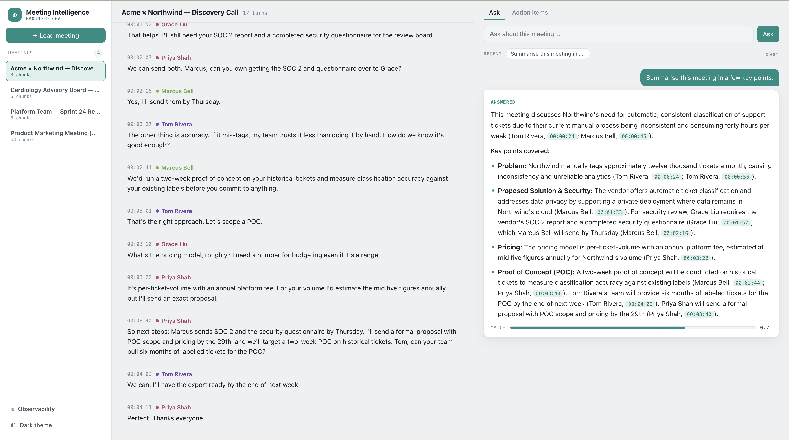
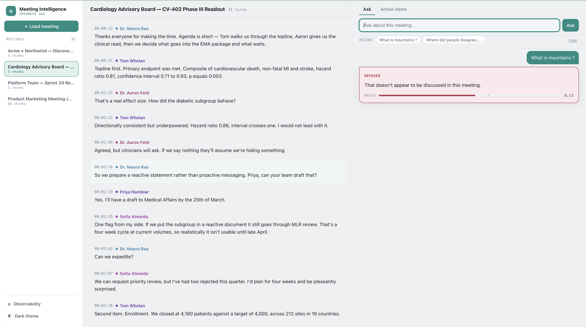
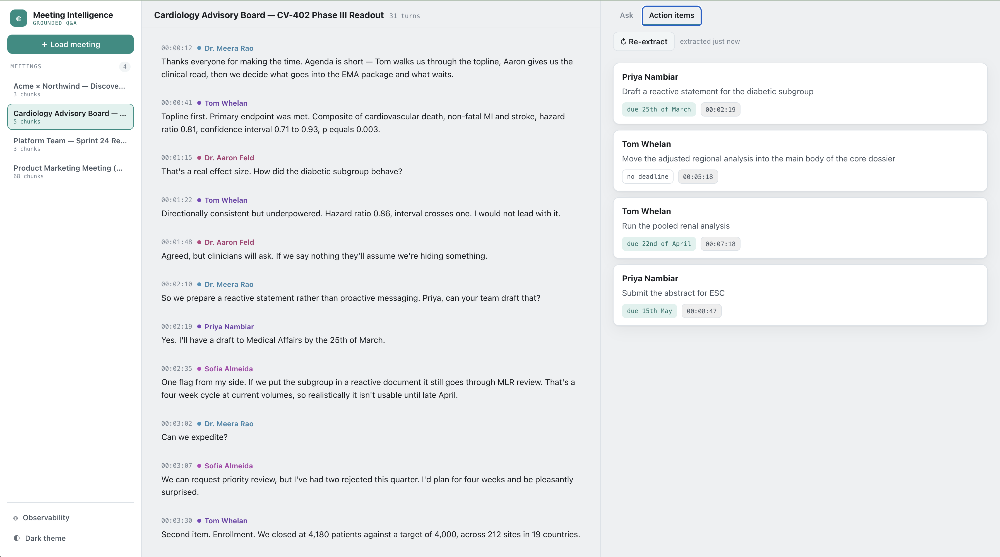
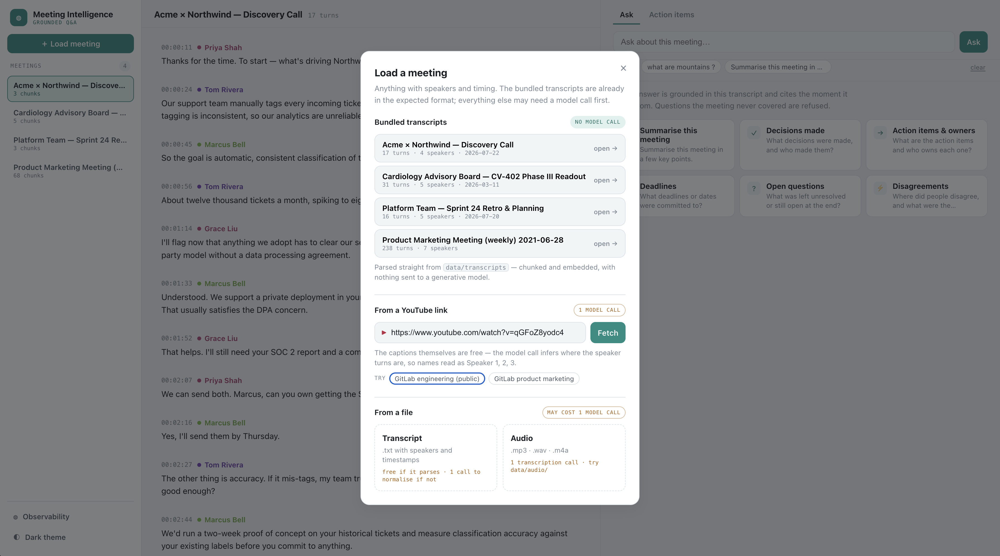
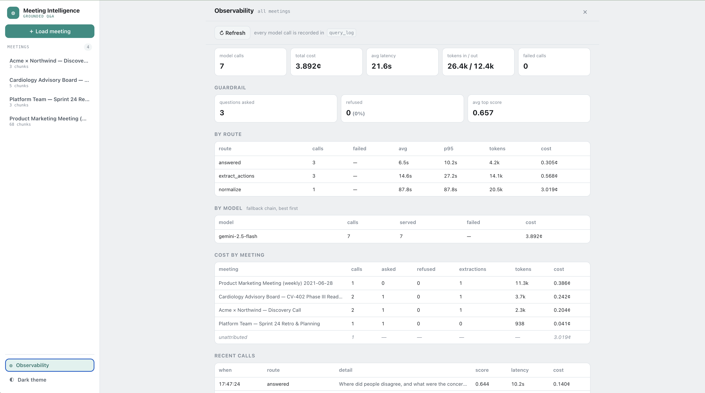
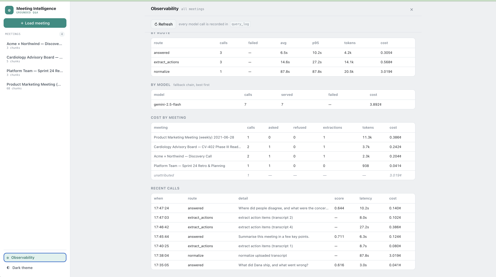
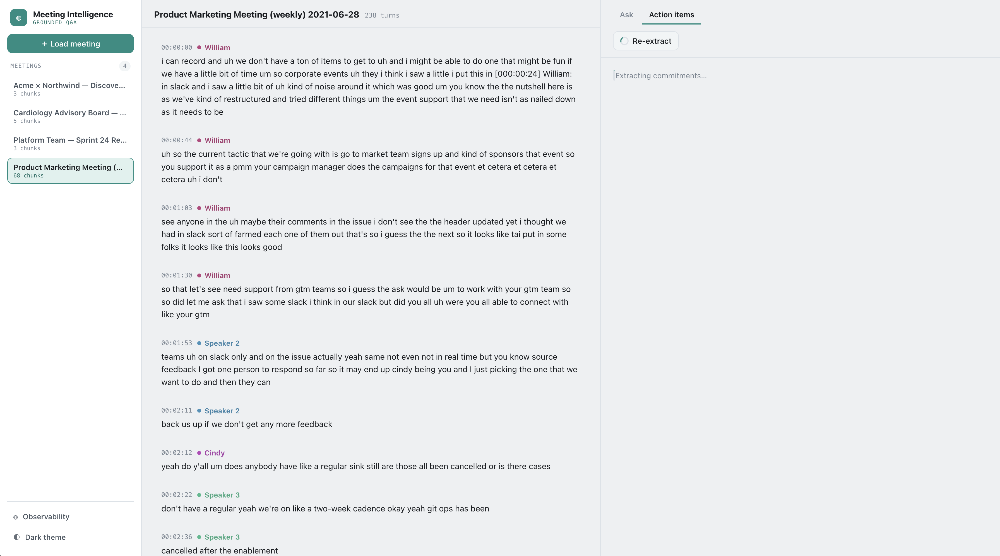

# Meeting Intelligence

Ask a question about a meeting transcript and get an answer that cites the speaker
and timestamp it came from. Click a citation and the transcript jumps there. Ask
about something the meeting never covered and it says so instead of improvising.
Also extracts action items. Transcripts come from text or audio.

## Quick setup

```bash
cp .env.example .env      # a working key is already in there
make up                   # db, api (:8000), web UI (:5173)
make health               # {"status":"ok","db":true,"pgvector":true,...}
```

`.env.example` ships with a disposable free-tier Gemini key so this runs with no
signup. That is a deliberate trade for review convenience, not how I'd handle a
secret otherwise: it is scoped to nothing but this API, capped at 20 requests per
day per model, and revoked once review is done. The Productionizing section below
is what I would actually do, and `.env` itself stays gitignored. If you hit the
cap, swap in your own key from
[aistudio.google.com/apikey](https://aistudio.google.com/apikey) — it takes about
thirty seconds.

Open **http://localhost:5173**, load one of the four bundled meetings, ask away.
`make test` runs 42 tests, `make eval` runs the retrieval eval, `make down` stops.

## Screenshots

▶ [Walkthrough video](docs/walkthrough.mp4) (5½ min) if you'd rather watch it than
read the rest of this.


Every claim carries a speaker and timestamp; clicking one jumps the transcript there.


Best chunk scored 0.53 against a 0.60 floor, so this was refused with no model call.



Extracted commitments with owners and deadlines. The load dialog labels what each
entry point costs in model calls.



Spend, latency, guardrail numbers and cost per meeting, read straight from `query_log`.

## Architecture

```
ingest  .txt / audio → parse → [LLM normalise if unparsable]
        → chunk (~200 tok, turn-aware) → embed (768-d) → pgvector

ask     question → cache hit? ─────────────────────→ answer (0 calls, ~5ms)
                 → embed → cosine top-5 → < 0.60? ─→ refuse (no model call)
                                        → ≥ 0.60? ─→ Gemini, grounded → answer + citations

every model call → query_log (tokens, cost, latency, model, error) → /observability
```

FastAPI, Postgres 16 with pgvector, React/Vite, in Docker Compose. Modules mirror
the two paths: `parsing`/`chunking`/`embeddings`/`ingest` write, `retrieval`/`answer`
read, `actions` extracts, `llm` owns the client and cost accounting.

## RAG approach

| Layer | Choice | Why |
|---|---|---|
| Chunking | turn-aware, ~200 tokens, 1 turn overlap | A turn never splits. 400 tokens collapsed a nine-minute meeting into two chunks and retrieval stopped discriminating. |
| Embeddings | `gemini-embedding-001`, 768-d | Task types embed a question differently from a document: 0.758 on a correct pairing against 0.718 on a wrong one. |
| LLM | Gemini flash | Grounded extraction over ~1k tokens. One provider across embedding, answering, transcription and normalisation. |
| Vector store | pgvector | Thousands of rows, and Postgres was already here for transcripts and the query log. |
| Orchestration | none | Embed, search, check a floor, generate, log is a function, not a graph. |
| Prompts | named constants in `prompts.py` | A prompt change stays a one-file diff. Context is bounded by construction at five chunks. |

**Guardrails.** A 0.60 similarity floor refuses before any model call; the answer
prompt then permits only the supplied excerpts. The second layer is needed because
the first can't stand alone: similarity captures topic, not referent. "What were the
results of the oncology trial?" scores 0.6934 against a cardiology meeting, above a
real answer at 0.6630.

**Quality.** `make eval` runs two labelled question sets through the real
`retrieve()`, plus the floor sweep that 0.60 came from. Both transcripts are
bundled, so the numbers reproduce on a fresh clone. One set's questions are
answerable in a *different* meeting, which checks retrieval stays scoped. The sweep
scores 0.60 and 0.65 identically on both sets, so the honest reading is that 24
questions can't discriminate inside that band.

```
advisory-board   recall 7/7   decisions 10/11 @ 0.60
youtube-pmm      recall 9/9   decisions 13/13 @ 0.60
```

**Observability.** Every model call writes route, tokens, cost, latency, model and
error to `query_log`, and the dashboard reads that table directly. Failures are
logged too: logging only successes made the dashboard look healthiest exactly when
quota had run out.

## Key decisions

**Answers and action items are cached.** Both are pure functions of an immutable
transcript, so neither needs a TTL. I argued at first that answers weren't worth
caching because questions are open-ended. The UI proved me wrong: recent chips and
starter buttons replay a question verbatim. 3.05s to 0.005s. Refusals stay uncached,
since caching them would hide every refusal from the guardrail metrics.

**Five pinned models in a fallback chain.** Free-tier quota is per project *per
model*, so one model is a hard stop after 20 calls. Pinned rather than `-latest`,
which resolved to a different model mid-build and silently moved us to another quota
bucket.

## Engineering standards

Containerised end to end, type hints throughout, prompts as constants, ten
dependencies each justified in `requirements.txt`, and 42 tests over what would fail
silently: chunker boundaries, floor-triggered refusal, ingest idempotency, cache
hit/miss, error mapping.

Skipped knowingly: no migration tool, so schema changes went in by hand *and* into
`init.sql` (real debt); no auth or multi-tenancy, the first thing I'd build before
anyone else used it; no CI, streaming or frontend tests; no answer-quality eval,
since faithfulness needs LLM-as-judge or labelled data.

## Productionizing

Containers to Cloud Run or ECS, Postgres to Cloud SQL or RDS with pgvector, frontend
to static assets on a CDN. The API is stateless; the database is the only stateful
piece. Two things break first: the sequential scan stops being free, so IVFFlat
becomes HNSW with the recall loss measured rather than assumed, and ingest is
synchronous so it belongs on a queue. Then backoff and a circuit breaker, managed
secrets, per-tenant row isolation, prompt-injection hardening, and `query_log`
shipped to a metrics backend with alerts on refusal and failure rates.

## How I used AI tools

`CLAUDE.md` is the working agreement, committed on purpose. The split is by failure
mode: chunking, retrieval, the floor, every prompt and the eval questions were
hand-written and reviewed line by line; Dockerfiles, wiring, frontend components and
test scaffolding were generated, then reviewed. Failures in the judgment layers are
silent, and boilerplate fails loudly, so generating boilerplate is cheap.

Two bugs make the case. The extraction prompt asked for `the [HH:MM:SS]`, and since
transcript lines look like `[HH:MM:SS] Speaker: text` the model returned
`"[00:02:30]"`, so every action-item citation was dead with no error anywhere. And
the eval harness queried across all meetings instead of one, quietly making its own
numbers wrong. Neither was found by reading code.

Rules: conventions live in the repo, not a chat window; commits stay small enough to
review; give it a decision you've already made rather than asking it to make one;
never let it pick a threshold.

## What I'd improve next

Mostly eval work, since the eval is what makes every other change arguable. Eleven
and thirteen questions across two meetings picks a threshold and little else, and
chunk size, overlap and `TOP_K` should be swept the way the floor was. Answer
faithfulness goes unscored, so prompt changes are unguarded. After that: migrations
from day one, hybrid retrieval for exact tokens like "CV-402", and a reranker.

## Known limitations

- Speaker labels from audio are inferred, not diarized.
- The floor can't tell topic from referent. The prompt mitigates it.
- Free-tier quota is 20 calls per day per model; the chain stretches it to ~100.
- Cache hits aren't logged, so the dashboard counts model calls, not requests.
- The normalise fallback is an LLM rewriting your file. Well-formed ones skip it.

## Bonus: voice to transcript

The optional bonus, and the cheapest thing here to build. Gemini is multimodal, so
audio bytes go in as a content part alongside a prompt forcing the output into
`[HH:MM:SS] Speaker: text`, which drops straight into the existing parser. No second
vendor, about twenty lines in `transcription.py`. There's a clip at
`data/audio/sprint-retro-clip.m4a` to try. Picking a multimodal provider for the
*text* pipeline is what made this nearly free. I'd like the points for it anyway.

## Addition: YouTube ingest

Not asked for. I added it because I needed real meetings: three transcripts I wrote
myself are clean, short, and quietly encode my assumptions about what a transcript
looks like. A YouTube link gives forty minutes of people talking over each other
with no punctuation and no speaker labels, which is where the second eval set came
from. Captions have timestamps but no speakers, so they reuse the same normaliser
built for odd uploads and then the existing pipeline.



Limitations specific to this path: speaker labels are inferred, so they read as
"Speaker 1, 2, 3", and captions past ~48k characters are truncated with the response
flagging it. YouTube also regenerates captions, so a re-ingest of the same video
won't be byte-identical. That's why the transcript behind the `youtube-pmm` eval set
is committed to `data/transcripts/` rather than fetched at eval time.
